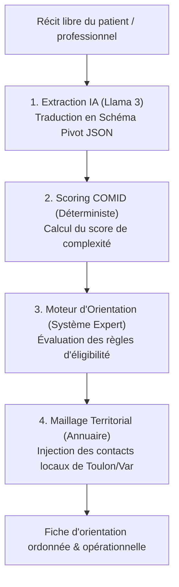

# 🧭 Manuel : Moteur d'Orientation Clinique & IA

---

## 1. Vue d'ensemble du Pipeline d'Orientation

Le moteur d'orientation d'ORIA repose sur une **architecture hybride unique**. Elle combine la puissance de compréhension linguistique d'un **Modèle de Langage (LLM - Llama 3)** pour l'extraction de signaux faibles, avec la rigueur et la transparence d'un **système expert déterministe** (moteurs de règles et scoring en Python pur). 

Cette conception garantit l'absence totale d'hallucinations lors des phases critiques de calcul clinique et de choix des structures d'accueil.

Le traitement d'une description patient s'exécute selon un flux rigoureux en **4 étapes successives** :

---

## 2. Étape 1 : L'Extraction Intelligente (LLM Text-to-Pivot)

*   **Composant majeur** : `SignalExtractor` (Classe Python)
*   **Fichier source** : [extractor.py](file:///c:/Users/milac/Documents/Projet%20ORIA/prototype-ORIA/backend/src/ai/extraction/extractor.py)
*   **Technologie** : LLM Llama 3 local hébergé via l'API **Ollama**

### Rôle fonctionnel
Le récit rédigé par le professionnel de santé ou l'aidant est un texte totalement libre, parfois décousu. L'IA a pour mission de lire ce texte et d'en extraire des variables standardisées en remplissant un formulaire standardisé appelé **Schéma Pivot**. Ce schéma est défini formellement dans le fichier [schema_definition.json](file:///c:/Users/milac/Documents/Projet%20ORIA/prototype-ORIA/config/schemas/schema_definition.json).

L'extracteur évalue l'état de l'usager sur 30 critères cliniques et sociaux (issus de la grille de complexité COMID), ainsi que des données clés (âge, commune de résidence, aides en place, hospitalisation récente).

### Paramètres de Fiabilité Clinique
Pour garantir une stabilité et une reproductibilité totale d'une analyse à l'autre, deux techniques avancées sont implémentées dans l'extracteur :

1.  **Température à 0.0 (Déterminisme)** :
    Le paramètre `temperature` du LLM est configuré à `0.0` dans [llm_client.py](file:///c:/Users/milac/Documents/Projet%20ORIA/prototype-ORIA/backend/src/infrastructure/llm_client.py). Cela neutralise le hasard et force l'IA à toujours sélectionner les mots ayant la plus haute certitude mathématique. Ainsi, un même récit produira systématiquement le même JSON structuré.
2.  **Chain of Thought (Chaîne de Pensée)** :
    L'IA n'a pas le droit de répondre simplement par `True` ou `False` à un critère. Elle est forcée d'expliquer sa démarche et de citer des preuves textuelles en écrivant une justification textuelle avant de poser son diagnostic. Cette "réflexion à voix haute" active les connexions sémantiques profondes du modèle et lui permet de déduire des critères complexes (par exemple, déduire une suspicion de danger ou d'errance).

> [!NOTE]
> **Exemple de déduction par CoT** : 
> *Phrase lue* : *"Madame Durand sort dans la rue en chemise de nuit à 3h du matin."*
> *Raisonnement CoT de l'IA* : *"Errance nocturne constatée en tenue inappropriée. Risque d'hypothermie ou d'accident de la route. Déduction : Risque de danger ou d'urgence avérée."*

---

## 3. Étape 2 : Le Scoring de Complexité COMID

*   **Composant majeur** : `ScoringEngine` (Classe Python)
*   **Fichier source** : [scoring_engine.py](file:///c:/Users/milac/Documents/Projet%20ORIA/prototype-ORIA/backend/src/application/scoring_engine.py)
*   **Ressource associée** : Référentiel des critères [COMID.json](file:///c:/Users/milac/Documents/Projet%20ORIA/prototype-ORIA/config/rules/COMID.json)

### Rôle fonctionnel
Une fois que le Schéma Pivot a été rempli par l'IA, le calcul de la complexité globale est délégué à un algorithme mathématique déterministe écrit en Python. Ce module calcule le score final en se basant sur la grille clinique **COMID**.

### Logique de calcul
Le fichier [COMID.json](file:///c:/Users/milac/Documents/Projet%20ORIA/config/rules/COMID.json) contient le barème officiel. Chaque critère s'est vu attribuer un poids numérique ou une catégorie. L'algorithme parcourt les critères confirmés par l'IA dans le Schéma Pivot, additionne les points de manière 100% logique, et attribue un label de complexité :

| Score Total | Niveau de complexité | Label affiché | Rôle Métier / Impact d'orientation |
| :---: | :--- | :--- | :--- |
| **0 à 8** | Situation non complexe | `Situation simple` | Maintien et suivi standards (CLIC, CCAS) |
| **9 à 15** | Situation à risque | `Situation à risque` | Besoins de coordination interprofessionnelle (DAC, CRT) |
| **16+** | Situation très complexe | `Situation très complexe` | Mobilisation urgente médico-sociale (Hôpital, CEV) |

> [!IMPORTANT]
> L'IA n'est jamais responsable du calcul du score. Elle n'est responsable que de la détection de la présence/absence des signaux de départ. C'est le code Python qui assure le calcul exact, garantissant une traçabilité et une explicabilité parfaites.

---

## 4. Étape 3 : Le Moteur d'Orientation (Le Système Expert)

*   **Composant majeur** : `OrientationEngine` (Classe Python)
*   **Fichier source** : [orientation_engine.py](file:///c:/Users/milac/Documents/Projet%20ORIA/prototype-ORIA/backend/src/application/orientation_engine.py)
*   **Ressource associée** : Cahier des charges logique [orientation_rules.json](file:///c:/Users/milac/Documents/Projet%20ORIA/prototype-ORIA/config/rules/orientation_rules.json)

### Rôle fonctionnel
Le moteur d'orientation prend le Schéma Pivot ainsi que le score COMID calculé et les soumet à une série de règles logiques métier. C'est l'arbitre qui décide quelles structures médico-sociales du Var sont éligibles pour accueillir ce patient.

### La structure logique des règles (ET / OU / NON)
Les critères d'éligibilité pour chaque structure sont modélisés de manière externe dans le fichier JSON pour permettre des modifications sans toucher au code Python. Le moteur évalue les filtres logiques suivants :

*   `all_of` : **Logique ET**. Toutes les conditions listées doivent être vraies simultanément.
*   `any_of` : **Logique OU**. Au moins une des conditions listées doit être vraie.
*   `none_of` : **Logique NON / Exclusion**. Aucune des conditions listées ne doit être vraie pour que la règle soit valide.

### Gestion des collisions et Priorités
Un patient lourdement impacté peut cocher les critères d'éligibilité de nombreuses structures (ex: DAC, CRT, CPTS, CLIC). Pour éviter de noyer le professionnel sous une liste désordonnée, ORIA trie les structures par un score de **priorité (de 0 à 100)** défini dans les règles :

1.  **Priorité Absolue (100 - 95)** : Urgences de sécurité ou circuits légaux incontournables (ex: Cellule Écoute & Vigilance en cas de maltraitance, Service Social Hôpital si hospitalisation).
2.  **Coordination Lourde (90 - 85)** : Structures pivot de coordination pour cas complexes (ex: CRT et DAC).
3.  **Première Ligne & Proximité (80 - 60)** : Solutions d'accompagnement social courantes (ex: CLIC, UTS, CPTS, CCAS).

---

## 5. Étape 4 : Le Maillage Territorial (L'Annuaire Intelligent)

*   **Composant majeur** : `TerritoryManager` (Classe Python)
*   **Fichier source** : [territory_manager.py](file:///c:/Users/milac/Documents/Projet%20ORIA/prototype-ORIA/backend/src/application/territory_manager.py)
*   **Ressource associée** : Base géographique [referentiel_territoire.json](file:///c:/Users/milac/Documents/Projet%20ORIA/prototype-ORIA/config/referentials/referentiel_territoire.json)

### Rôle fonctionnel
Une orientation théorique n'a aucune valeur si elle ne s'accompagne pas d'un point de contact opérationnel. Une fois les structures éligibles sélectionnées et ordonnées par priorité, le `TerritoryManager` interroge son référentiel en utilisant la commune de résidence détectée chez le patient.

Il extrait automatiquement :
*   Le nom exact de l'antenne locale de la structure (ex: *DAC Var Ouest - Toulon*).
*   L'adresse postale physique.
*   Le numéro de téléphone direct.
*   L'adresse e-mail de contact.

Si la commune n'est pas répertoriée ou est inconnue, le moteur injecte des coordonnées de secours (fallback) correspondant à l'échelon départemental ou de la préfecture afin de ne jamais laisser le professionnel sans solution de repli.
