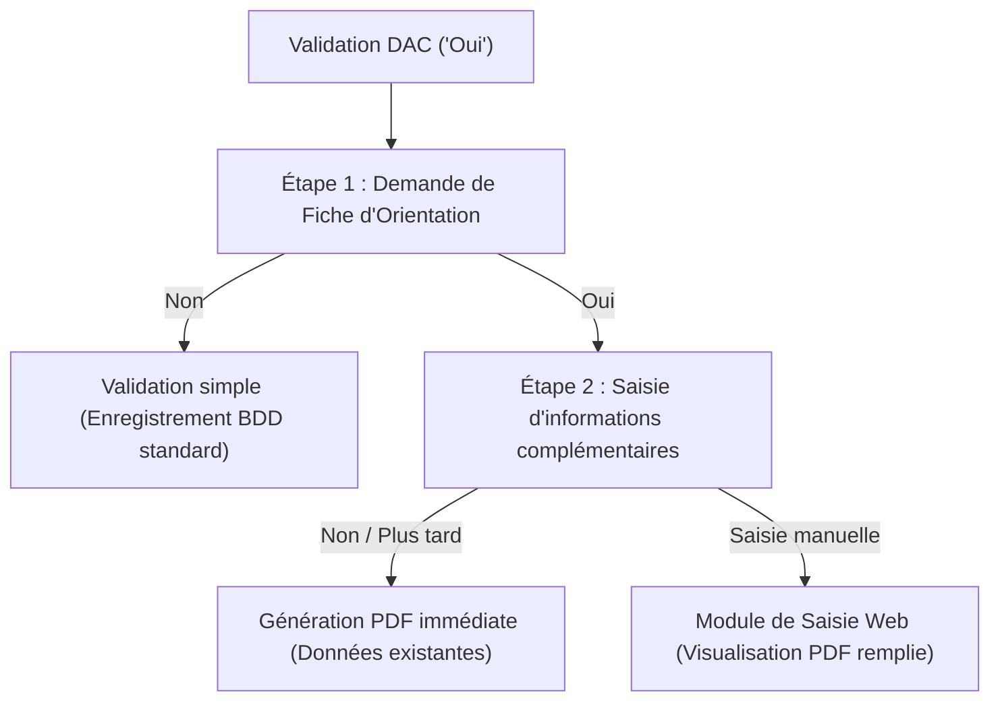

# 📄 Manuel : Remplissage Fiche Orientation (DAC)

---

## 1. Vue d'ensemble du Parcours DAC

Le **Dispositif d'Appui à la Coordination (DAC)** est une structure majeure pour l'accompagnement des parcours de santé complexes. Lorsqu'une situation de patient complexe (score COMID élevé) est détectée, le professionnel est orienté en priorité vers le DAC.

Plutôt que d'obliger le professionnel à ressaisir toutes les informations cliniques dans un formulaire externe, ORIA propose une **automatisation intelligente** :
1.  **Extraction ciblée de la fiche** : Une brique d'intelligence artificielle dédiée extrait les données administratives et l'écosystème de soins de l'usager directement à partir du récit d'origine.
2.  **Parcours pas-à-pas interactif** : Un assistant de validation (Wizard) dans l'interface utilisateur permet au professionnel de confirmer s'il veut générer la fiche et saisir d'éventuelles informations manquantes.
3.  **Génération et téléchargement instantané du PDF officiel** : Le système génère une fiche d'orientation au format PDF officiel, pré-remplie avec les informations extraites, prête à être visualisée et partagée.

---

## 2. Le Wizard DAC (Parcours Interactif)

*   **Composant UI** : `showDacWizard` (Fonction JavaScript)
*   **Fichiers sources** : [orienter.html](file:///c:/Users/milac/Documents/Projet%20ORIA/prototype-ORIA/backend/src/static/orienter.html) et [orienter.js](file:///c:/Users/milac/Documents/Projet%20ORIA/prototype-ORIA/backend/src/static/orienter.js)

Lorsqu'une orientation vers le DAC est validée par le bouton **"✅ Oui, elle convient"**, l'interface intercepte l'action et lance un parcours modale en plusieurs étapes :

---

## 3. L'Extraction Spécifique (`FicheDACExtractor`)

*   **Composant majeur** : `FicheDACExtractor` (Classe Python)
*   **Fichier source** : [fiche_extractor.py](file:///c:/Users/milac/Documents/Projet%20ORIA/prototype-ORIA/backend/src/ai/extraction/fiche_extractor.py)
*   **Endpoint API** : `POST /api/orientation/dac/generate_pdf`

La brique d'IA standard extrait les 30 critères cliniques COMID de base. Cependant, remplir un dossier d'admission DAC nécessite des détails administratifs et relationnels très précis. C'est pourquoi ORIA utilise un **deuxième extracteur spécialisé**, optimisé pour ce document :

### Données extraites par le prompt DAC :
*   **Identité de l'usager** : Nom d'usage, nom de naissance, prénoms, sexe, date de naissance (ou calcul de l'année à partir de l'âge), commune de naissance, adresse complète, et téléphone personnel.
*   **Aides en place** : Statut de l'APA, niveau de GIR, présence de droits MDPH ou ALD.
*   **Intervenants (Cercle de Soins)** : Identification de l'ensemble des professionnels impliqués (Médecin traitant, infirmier, aide à domicile/ADMR, pharmacien, kiné, assistante sociale, etc.) avec leurs coordonnées individuelles.

### Post-Processing et Nettoyage de Sécurité
Les modèles d'intelligence artificielle peuvent être trop zélés ou halluciner des informations en fonction du contexte. Le fichier `fiche_extractor.py` applique plusieurs règles strictes de post-traitement pour corriger les biais :
1.  **Calcul de l'âge** : Si l'IA extrait *"82 ans"*, une regex calcule automatiquement l'année de naissance estimée.
2.  **Nettoyage des civilités** : Suppression systématique des mentions *"Monsieur"*, *"Madame"* ou *"Dr."* dans les champs de noms pour respecter le format officiel.
3.  **Suppression des emails/téléphones fictifs** : Si le texte ne mentionne pas d'email, les LLM ont parfois tendance à inventer un email de type `medecin@exemple.com`. Le code nettoie ces fausses adresses.
4.  **Dédoublonnement du téléphone** : Si l'IA recopie le téléphone du médecin dans la case de l'usager, le post-processing détecte cette duplication et vide le champ pour éviter des erreurs administratives critiques.

---

## 4. La Génération PDF Dynamique (`PDFGenerator`)

*   **Composant majeur** : `PDFGenerator` (Classe Python)
*   **Fichier source** : [pdf_generator.py](file:///c:/Users/milac/Documents/Projet%20ORIA/prototype-ORIA/backend/src/application/pdf_generator.py)
*   **Dépendance externe** : `PyMuPDF` (appelé via `fitz`)
*   **Modèle source** : [fiche_dac_vierge.pdf](file:///c:/Users/milac/Documents/Projet%20ORIA/prototype-ORIA/backend/src/static/fiche_dac_vierge.pdf)

### Le principe technique
Le document [fiche_dac_vierge.pdf](file:///c:/Users/milac/Documents/Projet%20ORIA/prototype-ORIA/backend/src/static/fiche_dac_vierge.pdf) est un PDF interactif officiel qui contient des **champs de formulaires interactifs** (champs texte et cases à cocher).

Le `PDFGenerator` ouvre ce document source sous forme de flux binaire, parcourt ses widgets interactifs et injecte directement les valeurs textuelles ou booléennes de notre dictionnaire de données dans les clés de widgets correspondantes :

### Correspondances des formulaires interactifs (Mapping Clés-PDF)

| Variable JSON ORIA | Champ de Widget PDF | Type de widget | Description |
| :--- | :--- | :--- | :--- |
| `nom_usage` | `Texte9` | Texte | Nom de famille usuel |
| `nom_naissance` | `Texte11` | Texte | Nom de jeune fille |
| `prenoms` | `Texte13` | Texte | Prénom(s) de l'usager |
| `sexe` | `Texte16` | Texte | Sexe (M / F) |
| `date_naissance` | `Texte17` | Texte | Date de naissance estimée |
| `adresse_complete` | `Texte12` | Texte | Adresse du domicile principal |
| `telephone` | `Texte14` | Texte | Téléphone de l'usager |
| `vit_seul` ("Oui") | `Oui` | Case à cocher | Coche "Vit seul" |
| `vit_seul` ("Non") | `Non` | Case à cocher | Coche "Ne vit pas seul" |
| `lieu_actuel` ("domicile") | `A domicile` | Case à cocher | Coche la situation de logement |
| `apa` ("Oui") | `Case à cocher25` | Case à cocher | Bénéficiaire des aides départementales |
| `gir` | `Texte75` | Texte | Niveau de dépendance (ex: GIR 2) |
| `description_situation` | `Texte20` | Texte | Synthèse clinique rédigée par l'IA |

### Cartographie du Cercle de Soins (Intervenants)
Les professionnels identifiés dans `cercle_de_soins` sont mappés dynamiquement sur la page 2 du document PDF. Le `PDFGenerator` possède un dictionnaire interne permettant de positionner le nom, le téléphone et l'email du professionnel en face du champ désigné pour sa spécialité (ex: `Texte37`, `Texte38`, `Texte39` pour le médecin traitant).

### Export et Téléchargement
Une fois l'ensemble des widgets complétés et mis à jour (`widget.update()`), le document est écrit sous forme d'un tableau d'octets (`doc.write()`), puis retourné par l'API FastAPI au navigateur sous la forme d'un flux de fichier binaire (`application/pdf`) avec l'entête : `Content-Disposition: attachment; filename=fiche_orientation_dac.pdf`.
