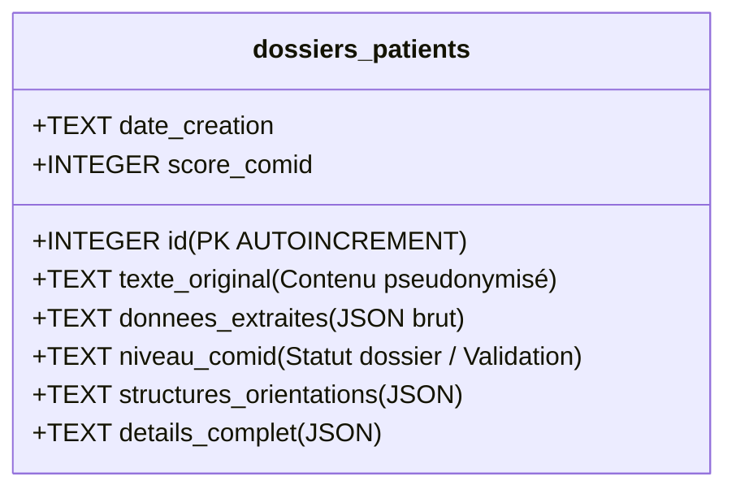

# 🔒 Manuel : Sauvegarde & Pseudonymisation des Données

---

## 1. Vue d'ensemble de la Sécurité des Données

Dans le cadre du traitement de dossiers médico-sociaux de personnes âgées, la confidentialité et le respect de la vie privée sont des obligations légales absolues (RGPD). ORIA intègre à sa base technique un **principe de minimisation et de pseudonymisation dès la conception (Privacy by Design)**.

Avant tout enregistrement dans la base de données SQLite locale, les récits textuels rédigés par les professionnels de santé ou les aidants sont expurgés de leurs données directement identifiantes (Noms propres et civilités) pour ne conserver que des structures anonymisées.

---

## 2. Le Module de Pseudonymisation (`Anonymizer`)

*   **Composant majeur** : `Anonymizer` (Classe Python)
*   **Fichier source** : [anonymizer.py](file:///c:/Users/milac/Documents/Projet%20ORIA/prototype-ORIA/backend/src/ai/security/anonymizer.py)

L'anonymiseur a pour mission de masquer les identités propres des patients et des professionnels cités au sein du texte.

### Le mécanisme technique
Le module utilise une expression régulière complexe et robuste pour détecter les civilités courantes suivies de mots avec une majuscule (noms propres) :

```python
self.title_pattern = re.compile(
    r'\b(Mme|M\.|Mr\.|Mlle|Madame|Monsieur|Mademoiselle)\s+([A-Z\u00c0-\u00dc][a-zA-Z\u00c0-\u00df\u00e0-\u00f6\u00f8-\u00ff\s\-\'\b]+)',
    re.UNICODE
)
```

Lorsqu'un nom propre est détecté, l'algorithme :
1.  Découpe le nom complet selon les espaces, tirets et apostrophes (permettant de gérer les noms composés comme *Jean-Pierre* ou *De L'Alba*).
2.  Élimine les faux-positifs en ignorant les mots courants de la langue française qui prennent une majuscule en début de phrase (mots clés ignorés : *Vit, Est, Elle, Il, Habite, Son, Sa, Ses, Leurs, Dans, Chez...*).
3.  Reconstruit le nom sous forme d'**initiales suivies de points**.

### Exemple concret
*   **Texte en entrée** : 
    > *"Le médecin s'inquiète pour Mme Antoinette Durand, 88 ans, habitant à Toulon. Monsieur Dubois, son gendre, nous a alertés."*
*   **Texte pseudonymisé** :
    > *"Le médecin s'inquiète pour Mme A. D., 88 ans, habitant à Toulon. Monsieur D., son gendre, nous a alertés."*

---

## 3. Le Gestionnaire de Base de Données (`DatabaseManager`)

*   **Composant majeur** : `DatabaseManager` (Classe Python)
*   **Fichier source** : [database.py](file:///c:/Users/milac/Documents/Projet%20ORIA/prototype-ORIA/backend/src/infrastructure/database.py)
*   **Fichier physique** : `oria_database.db` (Fichier SQLite local stocké à la racine)

### Pourquoi SQLite ?
Pour le prototype ORIA, la base SQL intégrée **SQLite** a été choisie. Elle présente l'avantage d'être incluse nativement dans Python (sans aucun service de base de données à installer en tâche de fond). La base de données tient intégralement dans le fichier physique `oria_database.db` à la racine, ce qui simplifie le déploiement et la portabilité du projet.

---

## 4. Structure des Tables de Données

La base de données gère la table principale de traçabilité clinique appelée `dossiers_patients` :



### Description des colonnes de `dossiers_patients`

| Colonne SQL | Type de Donnée | Description |
| :--- | :--- | :--- |
| **`id`** | `INTEGER` | Identifiant unique et incrémenté automatiquement pour chaque nouveau patient traité. |
| **`date_creation`** | `TEXT` | Horodatage exact de la soumission de la requête (Format `AAAA-MM-JJ HH:MM:SS`). |
| **`texte_original`** | `TEXT` | Le récit brut saisi à l'origine, **après passage obligatoire** dans le module `Anonymizer`. |
| **`donnees_extraites`** | `TEXT (JSON)` | Sérialisation en chaîne de caractères du **Schéma Pivot** contenant l'ensemble des 30 critères cliniques COMID. |
| **`score_comid`** | `INTEGER` | Le score mathématique final de complexité calculé par le `ScoringEngine`. |
| **`niveau_comid`** | `TEXT` | Label de complexité d'origine, ou statut de validation en cas d'intervention humaine (ex: *"Validé - DAC"*). |
| **`structures_orientations`**| `TEXT (JSON)` | Liste ordonnée de toutes les structures recommandées, leurs priorités, adresses et numéros de téléphone pour ce dossier. |
| **`details_complet`** | `TEXT (JSON)` | Conteneur d'extension stockant toutes les données techniques d'évaluation et l'historique complet des validations et feedbacks utilisateurs. |

---

## 5. Sérialisation & Désérialisation JSON

Comme SQLite ne gère pas nativement les types complexes (dictionnaires ou listes imbriquées), `DatabaseManager` effectue des opérations automatiques de conversion de données :

*   **À l'écriture (`save_dossier`)** : 
    Le gestionnaire utilise `json.dumps(obj, ensure_ascii=False)` pour convertir les dictionnaires Python en chaînes de caractères brutes lisibles et indexables.
*   **À la lecture (`get_all_dossiers` / `get_sankey_data`)** :
    Le gestionnaire applique la fonction `json.loads(chaine)` pour re-transformer le texte SQL en dictionnaires et objets Python exploitables directement par l'application ou par le frontend en JSON API.
